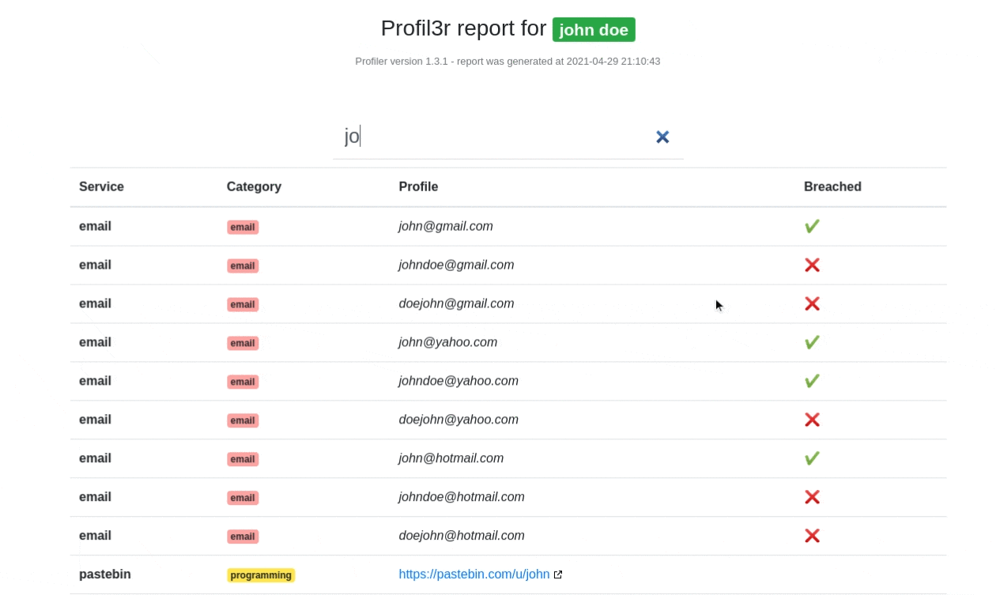

<p align=center>
  
  <br>
  <code>pip3 install profil3r && profil3r --help</code></br></br>
  <a target="_blank" href="https://www.python.org/downloads/" title="Python version"></a>
  <a target="_blank" href="https://www.python.org/downloads/" title="Python version"></a>
  <a target="_blank" href="LICENSE" title="License: MIT"></a>
  <a target="_blank" title="Downloads"></a>
  <a target="_blank" href="https://twitter.com/Rog3rSm1th" title="Python version"></a>
  <br>
  <span><i>Find the profiles of a person on social networks, as well as their email addresses</i></span>
</p>

<p align="center">
  <a href="#installation">Installation</a>
  &nbsp;&nbsp;&nbsp;|&nbsp;&nbsp;&nbsp;
  <a href="#features">Features</a>
  &nbsp;&nbsp;&nbsp;|&nbsp;&nbsp;&nbsp;
  <a href="#usage">Usage</a>
  &nbsp;&nbsp;&nbsp;|&nbsp;&nbsp;&nbsp;
  <a href="#contact">Contact</a>
</p>


Profil3r is an [OSINT](https://en.wikipedia.org/wiki/Open-source_intelligence) tool that allows you to find potential profiles of a person on social networks, as well as their email addresses. This program also alerts you to the presence of a data leak for the found emails.


## 💡 Prerequisites
[Python 3](https://www.python.org/)

## Installation

Install Profil3r :

```bash
pip3 install profil3r
```
## Features

#### 📙 Domain
- [x] TLD (.com, .org, .net, etc...)

#### ✉️ Emails 
- [x] Data leaks
- [x] Emails

#### 🌐 Social

|Service      | Profile Scraping |
|-------------|------------------|
| Instagram   | Yes ✔️            |
| Facebook    | No               |
| Twitter     | Yes ✔️            |
| Tiktok      | No               |
| Pinterest   | No               |
| Linktr.ee   | Yes ✔️            |
| MySpace     | Yes ✔️            |
| Flickr      | Yes ✔️            |
| DeviantArt  | No               |
| GoodReads   | No               |

#### 🎵 Music

|Service      | Profile Scraping |
|-------------|------------------|
| Soundcloud  | No               |
| Spotify     | No               |
| Smule       | No               |

#### ‍💻 Programming

|Service      | Profile Scraping |
|-------------|------------------|
| Github      | Yes ✔️            |
| Pastebin    | Yes ✔️            |
| LessWrong   | Yes ✔️            |
| Repl.it     | No               |
| Cracked.to  | No               |

#### 💬 Forum

|Service        | Profile Scraping |
|---------------|------------------|
| 0x00sec.org   | No               |
| Hackernews    | Yes ✔️            |
| Jeuxvideo.com | Yes ✔            |

#### 🗣️ Tchat

|Service        | Profile Scraping |
|---------------|------------------|
| Skype         | No               |

#### 📺 Entertainment

|Service        | Profile Scraping |
|---------------|------------------|
| Dailymotion   | No               |
| Vimeo         | No               |

#### 🚫 Porn

|Service        | Profile Scraping |
|---------------|------------------|
| PornHub       | Yes ✔            |
| RedTube       | No               |
| XVideos       | No               |

#### 💸 Money

|Service        | Profile Scraping |
|---------------|------------------|
| BuyMeACoffee  | No               |
| Patreon       | No               |

#### 🕸️ Web Hosting

|Service        | Profile Scraping |
|---------------|------------------|
| AboutMe       | Yes ✔            |
| SlideShare    | Yes ✔            |
| WordPress     | No               |

#### 🎮 Gaming 

|Service        | Profile Scraping |
|---------------|------------------|
| Gaming        | No               |

#### 📰 Medias

|Service        | Profile Scraping |
|---------------|------------------|
| Medium        | No               |

#### ✈️ Travel

|Service        | Profile Scraping |
|---------------|------------------|
| TripAdvisor   | No               |

#### 👥 Collaborative

|Service        | Profile Scraping |
|---------------|------------------|
| Wikipedia     | No               |


## Report

To further analyze the data collected by Profil3r, it is possible to generate reports in different formats using the argument ```-r/--report <path of the reports>```  

#### JSON

A report in JSON format is generated in the `reports/json` folder

#### CSV

A report in CSV format is generated in the `reports/csv` folder

#### HTML

A report in HTML format is generated in the `reports/html` folder, you can access it in your webbrowser



## Usage 

```
usage: profil3r [-h] -p PROFILE [PROFILE ...] [-r REPORT]

optional arguments:
  -h, --help            show this help message and exit
  -p PROFILE [PROFILE ...], --profile PROFILE [PROFILE ...]
                        parts of the username that you are looking for, e.g. : john doe
  -r REPORT, --report REPORT
                        path to the report directory, e.g. : ./OSINT
```

## 📚 Example

```bash
profil3r -p john doe -r ./OSINT
```

## 📝 License

This project is under the MIT license.

## Contact 

for any remark, suggestion or job offer, you can contact me at r0g3r5@protonmail.com or on twitter [@Rog3rSm1th](https://twitter.com/Rog3rSm1th)
